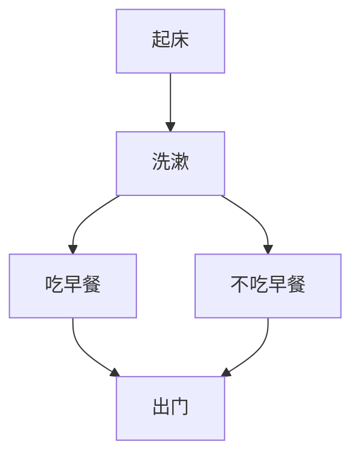

# 序
该文简单介绍一下在Hexo博客上画流程图。
# 正文

## mermaid
安装代码
```
npm install hexo-filter-mermaid-diagrams
```
打开**themes/next/_config.yml**
添加以下代码
```
# mermaid chart
mermaid: ## mermaid url https://github.com/knsv/mermaid
  enable: true  # default true
  version: "7.1.2" # default v7.1.2
  options:  # find more api options from https://github.com/knsv/mermaid/blob/master/src/mermaidAPI.js
    #startOnload: true  // default true
```
在**themes/next/layout/_partials/footer.swig**最后加上
```

  <script src='https://cdnjs.cloudflare.com/ajax/libs/mermaid/7.1.2/mermaid.min.js'></script>
  <script>
    if (window.mermaid) {
      mermaid.initialize({theme: 'forest'});
    }
  </script>

```

最后一步修改**根目录的_config.yml**，把external_link的值改为false，默认的为true，这一步绝大多数教程中都没有写。

mermaid画流程图
示例代码

>\`\`\`mermaid    
>graph TD;    
>    起床-->洗漱;    
>    洗漱-->吃早餐;    
>    洗漱-->不吃早餐;    
>    吃早餐-->出门;   
>    不吃早餐-->出门;  
>\`\`\`  

效果如下


## flow

安装代码
```
npm install --save hexo-filter-flowchart
```
然后无需其余配置  
flow画流程图示例代码如下

>\`\`\`flow  
>st=>start: Start|past:>http://www.google.com[blank]  
>e=>end: End:>http://www.google.com  
>op1=>operation: My Operation|past  
>op2=>operation: Stuff|current  
>sub1=>subroutine: My Subroutine|invalid  
>cond=>condition: Yes  
>or No?|approved:>http://www.google.com  
>c2=>condition: Good idea|rejected  
>io=>inputoutput: catch something...|request  
>st->op1(right)->cond  
>cond(yes, right)->c2  
>cond(no)->sub1(left)->op1  
>c2(yes)->io->e  
>c2(no)->op2->e  
>\`\`\`  

flow画流程图效果如下
```flow
st=>start: Start|past:>http://www.google.com[blank]
e=>end: End:>http://www.google.com
op1=>operation: My Operation|past
op2=>operation: Stuff|current
sub1=>subroutine: My Subroutine|invalid
cond=>condition: Yes
or No?|approved:>http://www.google.com
c2=>condition: Good idea|rejected
io=>inputoutput: catch something...|request

st->op1(right)->cond
cond(yes, right)->c2
cond(no)->sub1(left)->op1
c2(yes)->io->e
c2(no)->op2->e
```

## sequence
安装代码
```
npm install --save hexo-filter-sequence
```
然后无需其余配置。  
sequence 画流程图示例代码
>\`\`\`sequence  
>Alice->Bob: Hello Bob, how are you?  
>Note right of Bob: Bob thinks  
>Bob-->Alice: I am good thanks!  
>\`\`\`  

sequence 画流程图效果如下

```sequence
Alice->Bob: Hello Bob, how are you?
Note right of Bob: Bob thinks
Bob-->Alice: I am good thanks!
```

# 总结  
相比之下,mermaid的语法最简洁，渲染成图的过程最复杂，配置也最复杂。  
而flow和sequence相对而言配置简单一点，但是语法复杂一些。

---
# 参考资料
* [如何让你的HEXO博客支持手写流程图？](https://www.liuyude.com/How_to_make_your_HEXO_blog_support_handwriting_flowchart.html)
